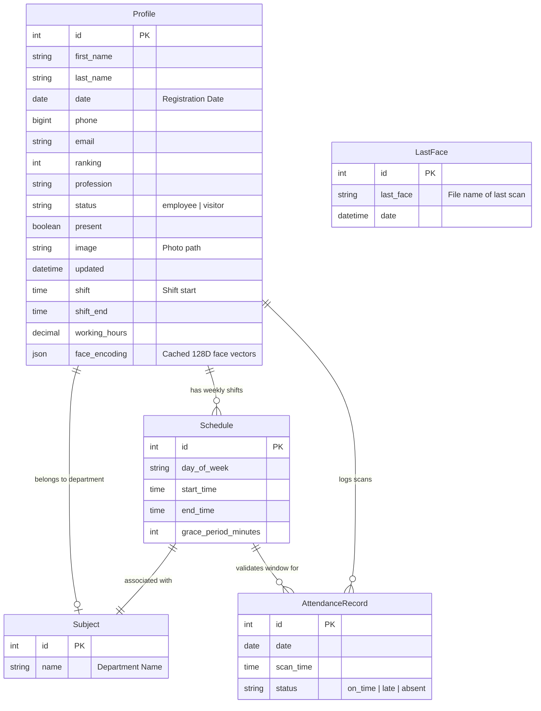

# 📸 Facial Attendance & Check-In Kiosk System

A modern, highly accurate, and real-time facial recognition attendance tracking system built with **Django**, **face_recognition**, **OpenCV**, and **SQLite**. 

This system features **both** a local desktop scanner (via OpenCV) and a fully-integrated browser-based kiosk scanner (using HTML5 camera capture and AJAX frame streaming). It simplifies attendance tracking for organizations, schools, or offices with automated late detection, customizable shift schedules, and dynamic performance ratings.

---

## 🌟 Key Features

### 👤 Profile & Face Cache Management
* **Automatic Face Encoding**: When an employee is created or their photo is updated, the system automatically uses the `face_recognition` library to extract facial vectors (128-dimensional coordinates) and cache them as a JSON object in the database. This avoids recalculating encodings on every scan, leading to near-instantaneous startup times.
* **Flexible Roles**: Categorize profiles as **Employees** or **Visitors**.

### ⏰ Advanced Shift & Schedule Configurations
* **Custom Shifts**: Assign work shifts, working hours, and grace periods (in minutes) for each employee.
* **Monday to Friday & Daily Rules**: Configure weekly schedules or specific shifts per day of the week.
* **Auto-calculated Shift End**: Automatically computes the shift end time based on the start time and working hours.

### 🎥 Dual-Mode Facial Scanning
1. **Web-Based Kiosk Mode (HTML5 Video Stream)**:
   * Accessible directly in the browser via `/details/`.
   * Captures frames via webcam using `getUserMedia` and streams base64 images to the `/scan_frame/` endpoint every 800ms.
   * Renders real-time bounding boxes around faces on an HTML5 `<canvas>` (Green for recognized, Red for unknown, Yellow for already checked-in).
   * Features a **15-second scanning cooldown** per person to prevent duplicate check-ins.
   * Plays browser-synthesized **audio alerts (Web Audio API)** and triggers beautiful HTML toasts upon successful check-in.
2. **Local Desktop Mode (OpenCV Video Capture)**:
   * Spawns a native OpenCV window from the server via `/scan/`.
   * Automatically recognizes profiles and updates attendance.
   * Plays a system beep sound (`winsound` on Windows) on detection.
   * Closes safely when pressing the `Enter` key.

### 📊 Attendance Logging & Automatic Status Evaluation
* **Grace Period Tracking**: Evaluates check-ins against the worker's active schedule. If they arrive within the grace period (e.g., 10 minutes), they are marked **On Time**. Otherwise, they are marked **Late**.
* **Dynamic Performance Rating**: Every profile features an evaluation rating from 0.0 to 10.0 calculated dynamically:
  $$\text{Rating} = \frac{\text{On Time} + (0.5 \times \text{Late})}{\text{Total Records}} \times 10$$
* **Auto-Presence (Django Signals)**: Post-save and post-delete database signals automatically sync the profile's active `present` status for the day.

---

## 📂 Project Architecture

```list
facial-attendance-system/
│
├── core/                       # Main application directory
│   ├── migrations/             # Database migrations
│   ├── sound/                  # Audio assets (beep.wav)
│   ├── templates/core/         # Django HTML templates
│   │   ├── add_profile.html    # Add/Edit employee page
│   │   ├── add_schedule.html   # Add/Edit schedule page
│   │   ├── attendance_report.html # Searchable history & reports
│   │   ├── base.html           # Layout boilerplate
│   │   ├── details.html        # HTML5 web-based kiosk scanner
│   │   ├── index.html          # Main metrics & presence dashboard
│   │   ├── profile_detail.html # Employee profile card & logs
│   │   ├── profiles.html       # Employee directory
│   │   └── schedules.html      # Shift schedule overview
│   ├── admin.py                # Admin site registrations
│   ├── apps.py                 # Core application config
│   ├── forms.py                # Django forms (Profile, Schedule, Subject)
│   ├── models.py               # Database schemas & signals
│   ├── urls.py                 # Core app routes
│   └── views.py                # Scanner logic, API endpoints, and dashboards
│
├── media/                      # Uploaded employee photos (untracked by Git)
├── project/                    # Django configuration directory
│   ├── settings.py             # Global settings (Timezone, Media configs)
│   └── urls.py                 # Main url definitions
│
├── requirements.txt            # Python package dependencies
├── runtime.txt                 # Python runtime version
├── manage.py                   # Django CLI utility
└── .gitignore                  # Git exclude configurations
```

---

## 💾 Database Schema

The database uses SQLite and includes the following relations:



---

## ⚙️ Installation & Setup

### Prerequisites
* **Python 3.10 to 3.12** is recommended.
* **CMake & Visual Studio Build Tools (C++ workloads)**: Required on Windows to compile the underlying `dlib` library.
  1. Download [Visual Studio Build Tools](https://visualstudio.microsoft.com/visual-cpp-build-tools/).
  2. During installation, select **Desktop development with C++** and install.
  3. Install CMake: `pip install cmake`

### Step-by-Step Installation

1. **Clone the Repository**:
   ```bash
   git clone https://github.com/faizan-ali-dev/facial_check_in_system.git
   cd facial-attendance-system
   ```

2. **Set Up a Virtual Environment**:
   ```bash
   python -m venv venv
   # On Windows:
   venv\Scripts\activate
   # On macOS/Linux:
   source venv/bin/activate
   ```

3. **Install Dependencies**:
   ```bash
   pip install --upgrade pip
   pip install -r requirements.txt
   ```

4. **Prepare Database Migrations**:
   ```bash
   python manage.py makemigrations
   python manage.py migrate
   ```

5. **Create an Admin Account**:
   ```bash
   python manage.py createsuperuser
   ```

6. **Run the Server**:
   ```bash
   python manage.py runserver
   ```

7. **Open the Dashboard**:
   Go to `http://127.0.0.1:8000` in your browser.
   To access the Django Admin panel, go to `http://127.0.0.1:8000/admin`.

---

## 🚀 How to Use

### 1. Add Departments & Employees
* Go to the **Schedules** page (`/schedules/`) and click **Add Shift / Department**.
* Navigate to the **Employees** page (`/profiles/`) and click **Add Employee**.
* Enter their details, shift start time (e.g., `09:00`), typical work hours, and upload a clear front-facing portrait. Upon saving, the backend will automatically generate and cache their face vectors.

### 2. Run the Scanner
* **Web Kiosk Mode (Recommended)**: Click **Kiosk Mode** or go to `/details/`. Grant camera permissions, and let the system run continuously. Faces appearing in the circle will scan, play a chime, show a Toast, and add the check-in status directly on the dashboard.
* **Desktop Mode**: Go to `/scan/` to start the OpenCV desktop frame window. Press `Enter` in the window to stop it.

### 3. Review Reports
* Navigate to `/attendance_report/` to view the comprehensive logs. You can filter logs by check-in status (On Time, Late, Absent), specific dates, or employee name.

### 4. Reset Daily Data
* Clicking **Reset** on the main dashboard clears today's check-in database logs and resets all employee statuses to "Absent" so they can scan again tomorrow.

---

## 🛠️ Troubleshooting

* **dlib installation fails**: Ensure you installed Visual Studio Build Tools with C++ selected. Without this compiler, pip cannot build the `dlib` wheel.
* **Webcam not starting**: Verify that no other application (Zoom, Teams, or the native OpenCV server view) is accessing your webcam.
* **Face not recognized**: Make sure the uploaded profile image is well-lit, clearly shows the front of the face, and is free of heavy obstructions like sunglasses. You can re-upload a photo on the profile edit screen to recalculate face encodings.
* **Invalid time zones**: The default timezone is configured to `Asia/Kolkata` (`project/settings.py`). Modify the `TIME_ZONE` variable in settings to match your regional timezone.

---

## 📄 License
Licensed under the [MIT License](LICENSE). 

---

## 🤝 Contact & Contributions
Feel free to open issues or submit pull requests for new features. For inquiries:
* **Name**: Faizan Ali
* **Email**: [faizancode68@gmail.com](mailto:faizancode68@gmail.com)
* **GitHub**: [faizan-ali-dev](https://github.com/faizan-ali-dev)
